# ソフトウェア仕様書

> 元ファイル: `DOC/基本設計書/ソフトウェア仕様書.docx`
>
> 画面キャプチャ・図はすべて `assets/ソフトウェア仕様書/` 配下に抽出済み。本書は作成途中の設計書であり、後半（3.1.2 以降）には別プロジェクト（"todojava_db" と表記されるTodoリスト系アプリ）のテンプレートを流用したまま未更新と思われる記述が混在している。該当箇所には注記を付けている。正式な仕様確認は `要件資料.md` と `ソフトウェア仕様書_WBS.xlsx`（各章のステータス）も合わせて参照すること。

作成 / 照査 / 認可（担当者・責任者）: 未記入

## 概要

本書は、[アプリ名]のソフトウェア仕様について記載したものである。（アプリ名は原文未確定のプレースホルダのまま）

## 目次（原文ママ）

> 元ファイルのWord目次（TOCフィールド）は本文の更新に追従しておらず、実際の本文は3.2 地図閲覧機能まで記載がある。目次は参考情報として原文のまま残す。

| 章番号 | 見出し | 元のページ |
| --- | --- | --- |
| 1 | 構成 | 3 |
| 1.1 | システム構成 | 3 |
| 1.2 | ソフトウェア開発環境 | 4 |
| 1.3 | バージョン遷移 | 4 |
| 1.4 | ソフトウェア構成図 | 4 |
| 1.5 | 機能対応項目 | 5 |
| 2 | 基本方針 | 6 |
| 3 | 詳細機能設計 | 8 |
| 3.1 | ログイン機能 | 8 |
| 3.1.1 | ログイン機能 | 8 |
| 3.1.2 | 忘却者ヒント | 12 |
| 3.2 | 新規アカウント登録 | 19 |
| 3.2.1 | 概要 | 19 |
| 3.2.2 | 表示内容 | 19 |
| 3.2.3 | 詳細仕様 | 22 |
| 3.3 | テスト | 27 |
| 3.3.1 | 概要 | 27 |

---

## 1. 構成

### 1.1 システム構成

以下にシステム構成図を示す（開発中の構成図）。

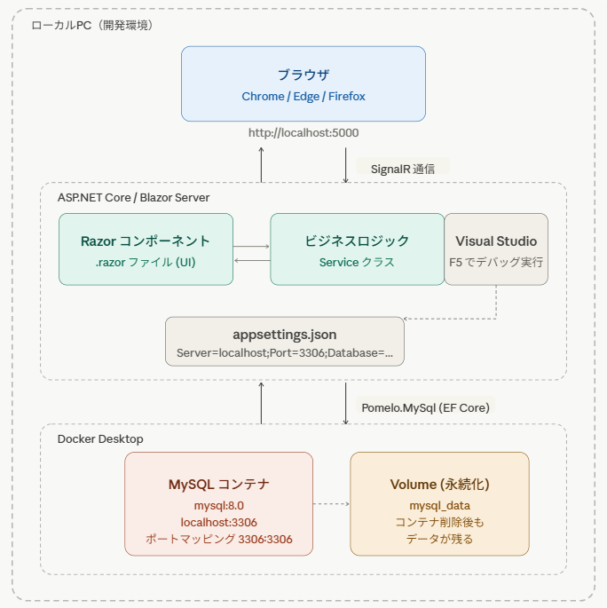

ローカルPC（ブラウザ：Chrome/Edge/Firefox）→ `http://localhost:5000` → ASP.NET Core / Blazor Server（Razorコンポーネント ⇔ Service層、appsettings.json）→ Pomelo.MySql (EF Core) → Docker Desktop上のMySQLコンテナ（`mysql:8.0`、`localhost:3306`）＋Volume（`mysql_data`、永続化）。

### 1.2 ソフトウェア開発環境

ソフトウェア開発環境は以下の通りである。結合試験は以下環境に準拠とする。

| 項目 | 内容 |
| --- | --- |
| 開発プラットフォーム | .NET Runtime |
| 開発言語 | C# 14 / .NET 10 |
| GUIフレームワーク | Blazor Server (ASP.NET Core) |
| 利用ライブラリ | Pomelo.EntityFrameworkCore.MySql、Leaflet.js |

### 1.3 バージョン遷移

| 対応名 | アプリバージョン |
| --- | --- |
| 新規開発 | Ver 1.0 |

### 1.4 ソフトウェア構成図

「ソフトウェア仕様書_別紙1_ソフトウェア構成図.xlsx」参照（本リポジトリの `DOC/基本設計書/` 内には現状このファイルは見当たらない）。

### 1.5 機能対応項目

| No. | 機能名 | 概要 | 章番号 |
| --- | --- | --- | --- |
| 1 | ログイン機能 | 起動時にDBと疎通確認する。起動時には必ず遷移する画面となる。【ログイン】入力されたメールアドレスとパスワードを元にユーザアカウントにログインするインタフェースを提供する。【パスワード再設定機能】秘密の質問を正しく選択することでパスワード設定可能となる。【新規アカウント登録】新規アカウントをメールアドレス、パスワード、秘密の質問をもとに登録する。 | 3.1 |
| 2 | 地図閲覧機能 | 【ピン表示機能】地図上にピンが表示されている。【ピン投稿機能】地図上で新規投稿をすることができる。【コメント機能】他者の投稿に対してコメントをすることができる。 |  |
| 3 | 通知機能 | 【エリア通知機能】エリア登録をし、そのエリア内に新規投稿があった場合通知する。【アラート機能】GPSでの現在地が危険区域に入った場合通知する。 |  |
| 4 | 削除、通報依頼機能 | 【削除機能】投稿に対して、削除依頼を出すことができる。 |  |
| 5 | 危険度ランキング機能 | 【危険度ランキング機能】危険度ランキングが表示される。 |  |
| 6 | 絞り込み検索機能 | 【絞り込み機能】ポップアップ内の絞り込み機能欄に情報を入力することで絞り込み機能を実行する。 |  |

---

## 2. 基本方針

> 原文には見出し直後に「基本方針：修正が必要」という編集メモが残っている（内容が確定していないことを示す）。

### 2.1 セキュリティ方針

**認証・認可**
- ユーザ認証情報は安全な方式で管理する。
- パスワード等の機密情報は平文保存しない。
- ユーザごとにアクセス可能なデータを制限する。
- 不正ログイン対策として認証試行制限を検討する。

**通信の保護**
- 通信経路は暗号化を前提とする。
- 認証情報やトークンの安全な取り扱いを行う。
- 機密情報をURL等へ含めない。

**入力値・出力値対策**
- 外部入力はすべて検証を行う。
- データベースアクセス時は安全なクエリ方式を使用する。
- 画面表示時はスクリプト実行を防ぐ対策を行う。
- SQLインジェクションやクロスサイトスクリプティング（XSS）等の脆弱性対策を考慮する。

**セッション管理**
- 認証状態には有効期限を設定する。
- ログアウト時には認証情報を無効化する。
- Cookie等を利用する場合は安全な属性を設定する。

**データ管理**
- 個人情報・機密情報は必要最小限のみ保持する。
- 機密情報をログへ出力しない。
- 必要に応じてバックアップを取得する。

**外部攻撃対策**
- APIや認証機能への過剰アクセス対策を行う。
- 管理機能には追加のアクセス制御を検討する。
- 一般ユーザが管理機能へアクセスできないよう制御する。

**依存ライブラリ・運用**
- 使用ライブラリは継続的に更新を行う。
- 既知の脆弱性があるライブラリは使用しない。
- 必要に応じてセキュリティ情報を定期確認する。

### 2.2 エラーハンドリング

**2.2.1 接続失敗時の処理**
- DB 接続失敗時（`DbException` / `MySqlException` のキャッチ）は、該当入力欄の近傍に赤文字でエラーメッセージを表示する。
- 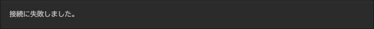
- DB 接続失敗時も、入力欄およびすべてのボタンはアクティブ状態を維持し、ユーザーが再試行できる状態とする。
- 入力欄が存在しないページ（地図画面・ピン一覧画面など）では、画面上部にバナーまたはトーストでエラーメッセージを表示する。

**2.2.2 接続失敗時の処理（クエリ失敗・タイムアウト）**
- DB への問い合わせで例外が発生した場合、または問い合わせタイムアウトが発生した場合は、エラーダイアログを表示する。
- ダイアログは OK ボタンまたはウィンドウ右上の × ボタン押下で閉じる。
- タイムアウト閾値：通常クエリ 30 秒、件数取得・集計など重量クエリ 60 秒（設定箇所：`DbContext.Database.SetCommandTimeout()`）。

**補足：例外処理の優先順位**

DB 操作時に複数の例外が連鎖する場合、以下の順序で評価し、最初に一致したルールを適用する。
1. `MySqlException`（`ErrorCode` が接続系）→ 2.2.1 のルール適用（赤文字表示、ボタンアクティブ維持）
2. `MySqlException`（タイムアウト / クエリ失敗）→ 2.2.2 のルール適用（ダイアログ表示）
3. その他の `DbException` → 2.2.4 の `ErrorBoundary` で捕捉

接続失敗が確定した場合は、後続のクエリ失敗処理を実行せずに 2.2.1 のルールで統一する。

**ログイン失敗時のメッセージ方針**

認証失敗時（メールアドレス不一致・パスワード不一致のいずれの場合も）、どちらの項目が誤っているかを特定できないよう、統一したメッセージを赤文字で表示する。セキュリティ上の理由から、「メールアドレスが存在しません」「パスワードが違います」等の個別メッセージは表示しない。

- 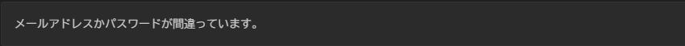

**予期しない例外発生時のユーザー通知**
- 予期しない例外が発生した場合、Blazor の `ErrorBoundary` コンポーネントを使用してアプリケーション全体のクラッシュを防ぐ。
- 配置戦略：各ページコンポーネント単位に配置する（`App.razor` への全体配置はページ全体が消えユーザー体験が著しく低下するため採用しない）。
- `ErrorBoundary` が補足できない例外（SignalR 接続断など）は、Blazor の再接続 UI に委ねる。
- ユーザーへの表示メッセージ例：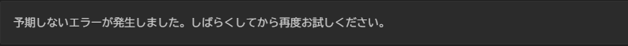
- 例外の詳細情報（スタックトレース等）はユーザー画面に表示せず、ログのみに出力する（→ 2.5 ログ出力方針 参照）。

**補足：データ保存操作中に予期しない例外が発生した場合の対応**

ピン投稿・コメント投稿・アカウント登録・パスワード再設定など、DB への書き込みを伴う操作中に `ErrorBoundary` で例外が捕捉された場合は、以下の方針を適用する。

- ユーザーへの表示メッセージ：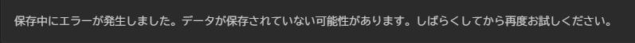
- 入力内容の保持：エラー発生前に入力されたデータは可能な限りフォームに残した状態でエラーを表示し、ユーザーが再入力なしに再試行できるようにする。ページ遷移が発生した場合はこの限りでない。
- 重複保存リスクの回避：書き込み操作は冪等性を考慮して実装する。トランザクションを使用し、例外発生時は必ずロールバックを行うことで、中途半端な状態でデータが保存されないようにする。
- 再試行ボタン：`ErrorBoundary` の `ErrorContent` 内に「再試行」ボタンを配置し、`ErrorBoundary.Recover()` を呼び出してコンポーネントを元の状態に復元できるようにする。
- ログ出力：発生した例外はスタックトレースを含めて Error レベルでログに出力する（→ 2.5 ログ出力方針 参照）。操作の種別（投稿・登録など）もログに含める。

**DB 接続の自動リトライ方針**
- Docker 環境ではコンテナ起動順序によって一時的な DB 接続失敗が発生しやすいため、Polly ライブラリを用いた自動リトライを実装する。
- リトライポリシー：最大 3 回、指数バックオフ（初回 1 秒 → 2 秒 → 4 秒）。
- 3 回すべて失敗した場合は 2.2.1 のエラー表示ルールを適用する。

**外部サービス障害時のフォールバック方針**
- SendGrid（メール送信）障害時：ユーザーに「メールの送信に失敗しました。しばらくしてから再度お試しください。」を表示し、生成済みトークンは即時無効化する（→ 2.6.2 参照）。
- GPS API（`navigator.geolocation`）障害時・権限拒否時：アラート通知を停止し、ユーザーに「位置情報が無効なため、アラート通知は届きません。」を表示する。その他の機能（地図閲覧・投稿）は継続可能とする（→ 2.6.3 参照）。

**共通ダイアログ（原文の別枠メモ）**
- DB接続失敗ダイアログ：DBに問い合わせを行い接続できなかった場合に表示。例：リスト、タスクの情報取得、ユーザのログイン時。
  - 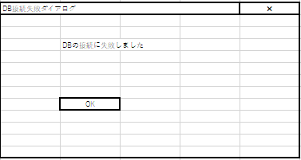
- 登録失敗ダイアログ：DBに登録処理を行ったが失敗したときに表示。例：リスト、タスクの登録時。

### 2.3 バリデーション方針

- システムへ入力される値については、入力形式・文字数・必須項目などの妥当性チェックを行う。
- 不正な値や想定外のデータが登録されないよう制御する。
- 入力値チェックはフロントエンド・バックエンド双方で実施する。
- クライアント側の入力値は信頼せず、サーバ側でも必ず検証を行う。
- データベース登録時には、型不一致や不正データ混入を防止する。
- 外部入力をそのまま画面表示しないようにし、必要に応じてエスケープ処理を行う。
- SQLインジェクションやクロスサイトスクリプティング（XSS）等の脆弱性対策を考慮する。
- エラーメッセージは利用者に分かりやすく表示しつつ、内部構造や機密情報を含めない。
- ファイルアップロード機能を実装する場合は、拡張子・サイズ・内容の検証を行う。
- 将来的な入力項目追加を考慮し、共通的なバリデーションルール管理を検討する。

### 2.4 命名規則・コーディング規約

- ソースコードの可読性・保守性向上のため、snake_caseを適用する。
- クラス名、関数名、変数名などは役割が分かる名称を使用する。
- 同一機能内で表記ゆれが発生しないよう統一する。
- 使用するプログラミング言語およびフレームワークの標準的なコーディング規約を基本とする。
- 共通処理の重複実装を避け、再利用可能な構成を意識する。
- コメントは必要最小限とし、処理内容ではなく目的や補足事項を記載する。
- 一時的な対応や暫定実装については、識別可能な形式でコメントを残す。
- 不要なコードや未使用の変数・ライブラリは残さない。
- ハードコーディングを避け、定数化・設定化を行う。
- ソースコードは第三者が理解しやすい構成を意識する。
- エラー処理は統一した方針で実装し、例外発生時の動作を明確にする。
- 将来的な機能追加や改修を考慮し、保守しやすい実装を行う。

### 2.5 ログ出力方針

**ログライブラリ**
- ログ出力には Serilog（ファイルシンク）を使用する。
- 出力先は Docker マウントボリューム上のログファイルとする。

**出力レベルの定義**

| レベル名 | 用途 |
| --- | --- |
| Information | 正常な操作ログ（ログイン成功、投稿完了、バリデーションエラーなど正常フローの一部） |
| Warning | システムが予期しない状態に近い事象（ログイン連続失敗によるブルートフォース検知前段など） |
| Error | 回復可能なエラー（DB 接続失敗など） |
| Critical | 回復不能な致命的エラー（Kestrel プロセスクラッシュ、証明書読み込み失敗など） |

**操作別ログレベル**

| 操作 | レベル |
| --- | --- |
| ログイン成功 | Information |
| ログイン失敗（１回） | Information |
| ログイン連続失敗（ブルートフォース検知） | Warning |
| パスワード再設定 | Information |
| 新規アカウント登録 | Information |
| ピン投稿 | Information |
| コメント投稿 | Information |
| 削除依頼の送信/承認/却下 | Information |
| SignalR 接続確立/切断 | Information |
| SendGrid 送信成功/失敗 | Information / Error |
| DB 接続エラー発生時 | Error |
| 予期しない例外発生時（スタックトレースを含む） | Error / Critical |

**ログ保存先・保持期間・ローテーション**
- 保存先：Docker マウントボリューム（ファイル出力）
- コンテナ内パス：`/app/logs/riskmap-.log`
- ホスト側マウントパス：`./logs:/app/logs`（`docker-compose.yml` の `volumes:` に定義）
- `appsettings.json` の Serilog path 設定をコンテナ内パスに一致させること。
- 保持期間：30 日間
- ローテーション設定（Serilog File Sink）：
  - `rollingInterval`: `RollingInterval.Day` — 日次ローテーション
  - `retainedFileCountLimit`: `30` — 最大30ファイル保持（30日分）
  - `fileSizeLimitBytes`: `50_000_000` — 1ファイルあたり50MB上限
  - `rollOnFileSizeLimit`: `true` — サイズ上限到達時も即時ローテーション
- ログにユーザーの個人情報（メールアドレス等）が含まれる場合、マスキング処理を施す（例：`us**@example.com`）（→ 2.7 データ保護・プライバシー方針 参照）。
- マスキング実装方式：Serilog の `Destructure.ByTransforming<T>()` と正規表現を組み合わせて実装する。マスキング対象フィールドはメールアドレスのみとし、@ より前の先頭2文字を残し残りを `**` に置換する（例：`us**@example.com`）。

### 2.6 外部サービス連携方針

**2.6.1 地図（Leaflet.js）との連携方針**
- Leaflet.js は JavaScript ライブラリであるため、Blazor Server の `IJSRuntime` を介して呼び出す。
- 地図の初期化処理は `OnAfterRenderAsync`（`firstRender == true` の場合のみ）で実行し、DOM 描画完了後に JS を呼び出す。
- Blazor → JavaScript の呼び出しには `IJSRuntime.InvokeVoidAsync` / `InvokeAsync` を使用する。
- JavaScript → Blazor（C#）への逆方向通信には `DotNet.invokeMethodAsync` を使用する（ピン作成時等）。
- JS Interop エラーハンドリング：`InvokeVoidAsync` / `InvokeAsync` の呼び出しは try-catch (`JSException`) で囲み、失敗時は Error レベルでログ出力したうえで「地図の読み込みに失敗しました。ページを再読み込みしてください。」をユーザーに表示する。地図初期化失敗時も、その他の機能（ピン投稿フォーム・サイドメニュー等）は継続可能とする。
- タイルプロバイダ：OpenStreetMap（無償・APIキー不要）を使用する。将来的にMapbox等へ切り替える場合は、APIキーを `appsettings.json` の環境変数注入経由で管理し、クライアント JS に直接埋め込まない。

**2.6.2 メール送信（パスワード再設定）の方針**
- パスワード再設定時、登録メールアドレス宛にパスワード再設定用 URL を記載したメールを送信する。
- メール送信には SendGrid（.NET SDK）を使用する。
- URL は有効期限付きトークンを含み、期限切れ後は無効化する。
- 送信失敗時の方針：SendGrid への送信が失敗した場合、生成済みトークンを即時無効化（DB から削除）し、ユーザーに「メールの送信に失敗しました。しばらくしてから再度お試しください。」を表示する。自動リトライは行わず、ユーザーが再申請する運用とする。
- リトライ：SendGrid の一時障害への対応は行わない（トークン残置によるセキュリティリスクを避けるため）。

**2.6.3 GPS・位置情報の連携方針**
- スマートフォンの GPS 情報はブラウザの `navigator.geolocation` API を介して取得し、`IJSRuntime` 経由で C# 側に連携する。
- 現在地が危険区域（1 つの字名内にピンが 5 個以上）に入った場合、アラート通知を行う。
- 字名ポリゴンデータ：国土交通省「国土数値情報（行政区域データ）」の字名レベル GeoJSON を使用する。無償・商用利用可。静的ファイルとしてアプリに同梱し、オフライン動作を可能とする。
- 危険区域判定アルゴリズム：GeoJSON を MySQL にインポートし、geometry 型カラムに格納する。GPS 座標と字名ポリゴンの包含判定には MySQL の空間関数 `ST_Contains(polygon, point)` を使用する。
- GPS 権限拒否・タイムアウト時の挙動：権限が拒否された場合 / タイムアウトが発生した場合は、「位置情報が無効なため、アラート通知は届きません。」をバナーで表示する。
- GPS 失敗時は SignalR によるアラート通知を停止するが、地図閲覧・ピン投稿・エリア通知など他の機能は継続可能とする。
- GPS 失敗の状態は Information レベルでログ出力する。

**2.6.4 プッシュ通知（SignalR）の方針**
- プッシュ通知には Blazor Server に内蔵されている SignalR を使用する。
- エリア通知：ユーザーが登録したエリア内に新規投稿があった場合、接続中のユーザーに通知する。
- アラート通知：GPS で取得した現在地が危険区域に入った場合、該当ユーザーに通知する。
- ブラウザを開いている間のみ通知が届く（バックグラウンド通知は対象外）。
- 想定同時接続数：最大 100 接続 を想定する。Blazor Server は 1 接続あたり約 250KB のメモリを消費するため、Docker コンテナのメモリ上限は最低 512MB を確保する（100 接続 × 250KB + アプリ本体分）。
- スケールアウト方針：同時接続数が 100 を超える場合は、Azure SignalR Service または Redis Backplane の導入を検討する。

### 2.7 データ連携・プライバシー方針

本システムは個人情報の保護に関する法律（個人情報保護法）を遵守し、収集する個人情報を利用目的の達成に必要な範囲内でのみ取り扱う。

**個人情報（メールアドレス）の取り扱い**
- メールアドレスはユーザー識別のためにのみ使用し、第三者への提供は行わない。
- DB 上のメールアドレスへのアクセスは、認証済みユーザーおよびシステム管理者のみに限定する。

**投稿データの公開範囲**
- 投稿データ（ピン情報）はログイン済みユーザーのみが閲覧可能とする。
- 投稿者の個人情報（メールアドレス等）は他ユーザーに表示しない。
- ViewModel 分離の徹底：ピン情報を返す際は、User エンティティをそのままバインドせず、必要なフィールドのみを含む ViewModel（例：`PinViewModel`）に変換する。Blazor の Razor コンポーネントで `@user.Email` 等の個人情報フィールドを直接描画しない。

**削除依頼データの保持ルール**
- 削除依頼は運営側が確認するまでの間、DB 上に保持する。
- 削除依頼が承認された場合、対象のピン投稿は論理削除（`is_deleted = 1`、`deleted_at = NOW()`）とする。物理削除は行わない。
- 不当な削除依頼を多数行ったユーザーへの対応：`deletion_requests` テーブルの `requester_id` で却下件数を集計し、却下 3 件以上で users テーブルの `is_banned = 1` フラグを立て、以降の削除依頼送信を制限する。
- BAN 状態のユーザーは削除依頼フォームを非表示にし、送信 API でも弾く（二重防御）。

**GPS・位置情報の取り扱い**
- GPS 座標（`navigator.geolocation`）は危険区域判定（`ST_Contains`）にのみ使用し、その他の目的では使用しない。
- DB に保存するピン投稿の座標は小数点以下 4 桁（約 11m 精度）に丸めて格納し、それ以上の精度は保持しない。
- 危険区域判定時に使用した GPS 座標はログに出力しない（判定結果のみをログに残す）。
- GPS 権限拒否・タイムアウト時の挙動は 2.6.3 の方針を適用する。

**ユーザ名（メールアドレス）の登録に関する原文メモ**
- `[todojava_db]users` テーブル.emailカラムの長さを320に設定し最大長を確保。
- `[todojava_db]users` テーブル.emailカラムにNOT NULL制約を設定し空値防止。
- メールアドレスのバリデーションには正規表現を使用すること。

> 上記メモは `todojava_db` という他プロジェクトのDB名を参照しており、本プロジェクトのDB名（テーブル定義書では特に明記されたDB名なし、スキーマ名は `RiskMap_DB` と推定）と食い違っている。旧テンプレートの記述が残ったものと考えられるため、実装時は `テーブル定義書.md` の `users` テーブル定義を正とすること。

---

## 3. 詳細機能設計

### 3.1 ログイン機能

#### 3.1.1 ログイン機能

**概要**
- ログイン用にメールアドレスとパスワードを入力するインタフェースを提供する。
- ログイン成功後に地図閲覧画面に遷移する。

**表示内容**

表示更新および表示内容は「初期表示」「ユーザ名（メールアドレス）、パスワード入力中」「ログイン失敗時」の3状態がある。参考画面：

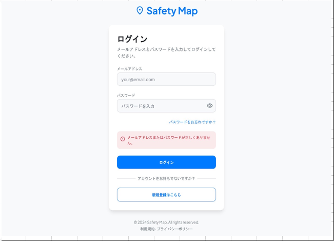

＜初期表示＞

| No. | 項目名 | 固定 | 表示内容 | 備考 |
| --- | --- | --- | --- | --- |
| ① | メールアドレス入力欄 |  |  | 空文字 |
| ② | パスワード入力欄 |  |  | 空文字 |
| ③ | パスワード再設定誘導用リンク | 〇 | パスワードをお忘れですか？ | 固定文言、押下可能 |
| ④ | 入力バリデーションラベル |  |  | 非表示 |
| ⑤ | ログインボタン | 〇 | ログイン | 固定文言、押下不可 |
| ⑥ | 新規アカウント登録ボタン | 〇 | 新規登録はこちら | 固定文言、押下可能 |
| ⑦ | アプリ名ラベル | 〇 | RiskMap | 固定文言 |
| ⑧ | ログインラベル | 〇 | ログイン | 固定文言 |
| ⑨ | 指示用ラベル | 〇 | メールアドレスとパスワードを入力してログインしてください。 | 固定文言 |
| ⑩ | メールアドレスラベル | 〇 | メールアドレス | 固定文言 |
| ⑪ | パスワードラベル | 〇 | パスワード | 固定文言 |
| ⑫ | パスワード表示/非表示ボタン | 〇 | 記号 | 固定文言、押下可能 ※1 |
| ⑬ | 補助文言ラベル | 〇 | アカウントをお持ちでないですか？ | 固定文言 |

※1 3.1.1.3 ②にて記載

＜メールアドレス、パスワード入力中＞

| No. | 項目名 | 固定 | 表示内容 | 備考 |
| --- | --- | --- | --- | --- |
| ① | メールアドレス入力欄 |  |  | 入力内容表示 |
| ② | パスワード入力欄 |  |  | 入力内容表示 |
| ③ | パスワード再設定誘導用リンク | 〇 | パスワードをお忘れですか？ | 固定文言、押下可能 |
| ④ | 入力バリデーションラベル |  |  | 非表示 |
| ⑤ | ログインボタン | 〇 | ログイン | 固定文言、押下可能 |
| ⑥ | 新規アカウント登録ボタン | 〇 | 新規登録はこちら | 固定文言、押下可能 |
| ⑦ | アプリ名ラベル | 〇 | RiskMap | 固定文言 |
| ⑧ | ログインラベル | 〇 | ログイン | 固定文言 |
| ⑨ | 指示用ラベル | 〇 | メールアドレスとパスワードを入力してログインしてください。 | 固定文言 |
| ⑩ | メールアドレスラベル | 〇 | メールアドレス | 固定文言 |
| ⑪ | パスワードラベル | 〇 | パスワード | 固定文言 |
| ⑫ | パスワード表示/非表示ボタン | 〇 | ※1 | 固定文言 |
| ⑬ | 補助文言ラベル | 〇 | アカウントをお持ちでないですか？ | 固定文言 |

※1 3.1.1.3 ②にて記載

＜ログイン失敗時＞

| No. | 項目名 | 固定 | 表示内容 | 備考 |
| --- | --- | --- | --- | --- |
| ① | メールアドレス入力欄 |  |  | 入力内容表示 |
| ② | パスワード入力欄 |  |  | 入力内容表示 |
| ③ | パスワード再設定誘導用リンク | 〇 | パスワードをお忘れですか？ | 固定文言、押下可能 |
| ④ | 入力バリデーションラベル |  |  | ※1 |
| ⑤ | ログインボタン | 〇 | ログイン | 固定文言、押下可能 |
| ⑥ | 新規アカウント登録ボタン | 〇 | 新規登録はこちら | 固定文言、押下可能 |
| ⑦ | アプリ名ラベル | 〇 | RiskMap | 固定文言 |
| ⑧ | ログインラベル | 〇 | ログイン | 固定文言 |
| ⑨ | 指示用ラベル | 〇 | メールアドレスとパスワードを入力してログインしてください。 | 固定文言 |
| ⑩ | メールアドレスラベル | 〇 | メールアドレス | 固定文言 |
| ⑪ | パスワードラベル | 〇 | パスワード | 固定文言 |
| ⑫ | パスワード表示/非表示ボタン | 〇 | ※2 | 固定文言 |
| ⑬ | 補助文言ラベル | 〇 | アカウントをお持ちでないですか？ | 固定文言 |

※1 3.1.1.3 ①【条件に該当するレコードが存在しない】、【DBへの問い合わせに失敗した】にて記載
※2 3.1.1.3 ②にて記載

**詳細仕様**

メールアドレス入力欄とパスワード入力欄に入力されたメールアドレスとパスワードをキーにDB名.users（テーブル名）に該当アカウントが存在するかどうかチェックする。

| 項目 | 内容 |
| --- | --- |
| 検索条件 | ・DB名.usersテーブル.emailカラム(仮) = [画面]メールアドレス入力欄　・DB名.usersテーブル.passwordカラム(仮) = [画面]パスワード入力欄 |

- 【条件に該当するレコードが存在する】ログイン成功と判断し、マップ画面に遷移する。
- 【条件に該当するレコードが存在しない】該当アカウントが存在しないと判断し、画面にエラーメッセージを表示する。→ 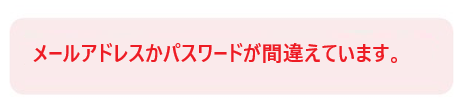
- 【DBへの問い合わせに失敗した】DB接続時で例外が発生した場合や、問い合わせタイムアウトが発生した場合にエラーメッセージを表示する。→ 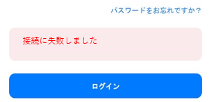
- DB接続失敗時、各種ボタンはすべて押下可とする。
- パスワード表示/非表示ボタンについて、自前で用意した画像をボタンとして使用する。

■その他ボタン押下処理
- 「パスワードをお忘れですか？」ボタンを押下することで、パスワード再設定画面（X.X章）に遷移する。
- 「新規登録はこちら」ボタンを押下することで、新規アカウント登録画面（X.X章）に遷移する。

#### 3.1.2 パスワード再設定機能（原文見出し「忘却者ヒント」）

> **注記：この節はRiskMap向けに未更新の旧テンプレート内容とみられる。** `todojava_db`・`Try Login`・`タイトルへ戻る` 等、RiskMapの要件（秘密の質問方式、メールURLによる再設定 — `要件資料.md` 参照）と異なる旧アプリ（Todoリスト系アプリ）の文言・画面が残っている。WBS上も3.1.2は「未着手」のステータス。実装時はこの節ではなく `要件資料.md`（パスワード再設定機能）を正として参照すること。以下は原文の記録として残す。

**概要**

パスワードを忘却したユーザーに対して、パスワード再設定機能を提供する。

参考画面（RiskMap版、秘密の質問入力・エラー表示あり）：

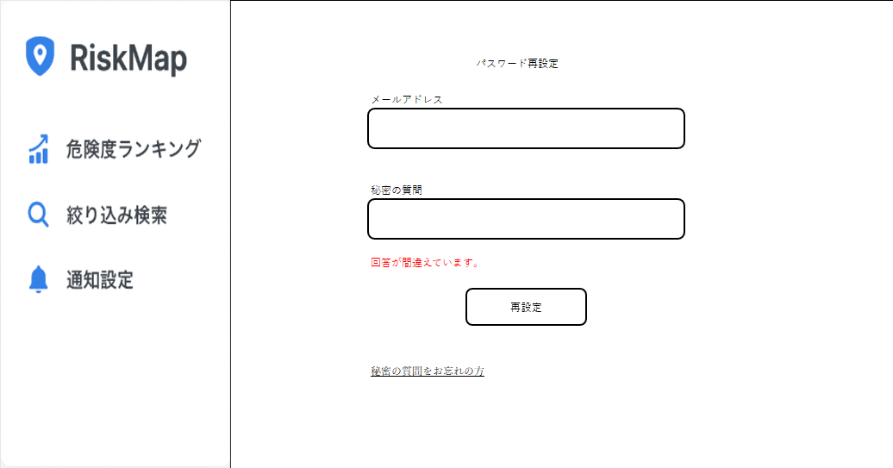

＜初期表示＞

| No. | 項目名 | 固定 | 表示内容 | 備考 |
| --- | --- | --- | --- | --- |
| ① | 画面名ラベル | ○ | パスワードを忘れた方へ　秘密のパスワード入力画面 | 固定文言 |
| ② | ユーザ名ラベル | ○ | ユーザ名（メールアドレス）を入力 | 固定文言 |
| ③ | ヒントラベル |  | supportボタン押下後、成功時：ヒント文表示 | ※初期表示：ヒントが欲しい人は自身のメールアドレス入力しsupportボタン押下 |
| ④ | Supportボタン | ○ | support | 固定文言、押下不可 |
| ⑤ | ユーザ名入力欄 |  | 入力欄（メールアドレス） | 空文字状態の表示 |
| ⑥ | 秘密のパスワード入力欄 |  | 入力欄（秘密のパスワード） | 空文字状態の表示 |
| ⑦ | ログインボタン | ○ | Try Login | 固定文言、押下不可 |
| ⑧ | タイトルへ戻るボタン | ○ | タイトルへ戻る | 固定文言、押下可能 |

＜ユーザ名（メールアドレス）、秘密のパスワード入力中＞

| No. | 項目名 | 固定 | 表示内容 | 備考 |
| --- | --- | --- | --- | --- |
| ① | 画面名ラベル | ○ | パスワードを忘れた方へ　秘密のパスワード入力画面 | 固定文言 |
| ② | ユーザ名ラベル | ○ | ユーザ名（メールアドレス）を入力 | 固定文言 |
| ③ | ヒントラベル |  | supportボタン押下後、成功時：ヒント文表示 | ※初期表示：ヒントが欲しい人は自身のメールアドレス入力しsupportボタン押下 |
| ④ | Supportボタン | ○ | support | 固定文言、押下可能 ※1 |
| ⑤ | ユーザ名入力欄 |  | [画面]ユーザ名入力欄 | 入力文字を表示 |
| ⑥ | 秘密のパスワード入力欄 |  | [画面]秘密のパスワード入力欄 | 入力文字を表示 |
| ⑦ | ログインボタン | ○ | Try Login | 固定文言押下可能 ※2 |
| ⑧ | タイトルへ戻るボタン | ○ | タイトルへ戻る | 固定文言、押下可能 |

※1 ユーザ名入力欄の入力文字列が空文字ではなく、かつメールアドレスのフォーマットであるときに限り押下可能。
※2 ユーザ名入力欄・秘密のパスワード入力欄がともに空文字ではなく、ユーザ名入力欄がメールアドレスのフォーマットであるときに限り押下可能。

＜supportボタン押下時＞

| No. | 項目名 | 固定 | 表示内容 | 備考 |
| --- | --- | --- | --- | --- |
| ① | 画面名ラベル | ○ | パスワードを忘れた方へ　秘密のパスワード入力画面 | 固定文言 |
| ② | ユーザ名ラベル | ○ | ユーザ名（メールアドレス）を入力 | 固定文言 |
| ③ | ヒントラベル |  | `[todojava_db]users`テーブル.secret_password | ヒント文表示※2 |
| ④ | Supportボタン | ○ | support | 固定文言 |
| ⑤ | ユーザ名入力欄 |  | [画面]ユーザ名入力欄 | 入力文字を表示 |
| ⑥ | 秘密のパスワード入力欄 |  | 入力欄（秘密のパスワード） | 空文字状態の表示 |
| ⑦ | ログインボタン | ○ | Try Login | 固定文言押下可能 ※1 |
| ⑧ | タイトルへ戻るボタン | ○ | タイトルへ戻る | 固定文言、押下可能 |

**詳細仕様**

① ユーザ名入力欄に入力されたユーザ名をキーに `[todojava_db]users` に該当するアカウントが存在するかチェックする。
- 検索条件：`[todojava_db]users.email` = [画面]ユーザ名入力欄
- 【該当あり】ヒント文を表示（`users.secret_tips_id = secret_tips.id` で紐づく `secret_tips` を参照）
- 【該当なし】エラーダイアログ表示（OK/×で閉じる）→ 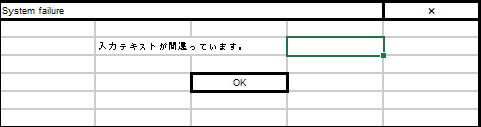

② ユーザ名入力欄と秘密のパスワード入力欄をキーに該当アカウントが存在するかチェックする。
- 検索条件：`users.email` = [画面]ユーザ名入力欄 かつ `users.secret_password` = [画面]秘密のパスワード入力欄
- 【該当あり】ログイン成功と判断し、（原文ママ）リスト型表示に遷移する
- 【該当なし】エラーダイアログ表示（OK/×で閉じる）

③ ヒント文の種類：小学校の名前／中学校の名前／両親の旧姓
④ ヒント文表示可能文字数：上限12byte（全角6文字・半角12文字）、上限超過分はDBに登録されていても無視する。

【DBへの問い合わせに失敗した】DB接続ライブラリで例外が発生した場合や、問い合わせタイムアウトが発生した場合にエラーダイアログを表示する（OK/×で閉じる）。→ 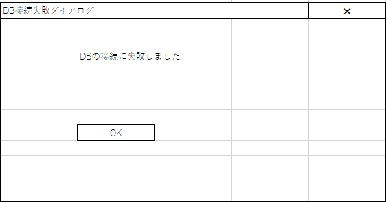

#### 3.1.3 新規アカウント登録

> **注記：この節も3.1.2と同様、他プロジェクト（todojava_db）のテンプレートが未更新のまま残っていると見られる。** ワイヤーフレーム（下記画像）もRiskMapのブランディングではない汎用アプリの見た目。実装時は `要件資料.md`（新規アカウント登録機能）・`画面設計書.md`（新規アカウント登録）を正として参照すること。

**概要**

アカウント登録が未了のユーザに対して、メールアドレスとパスワードと忘却者へのヒントを登録するインタフェースを提供する。

＜初期表示（旧ワイヤーフレーム）＞

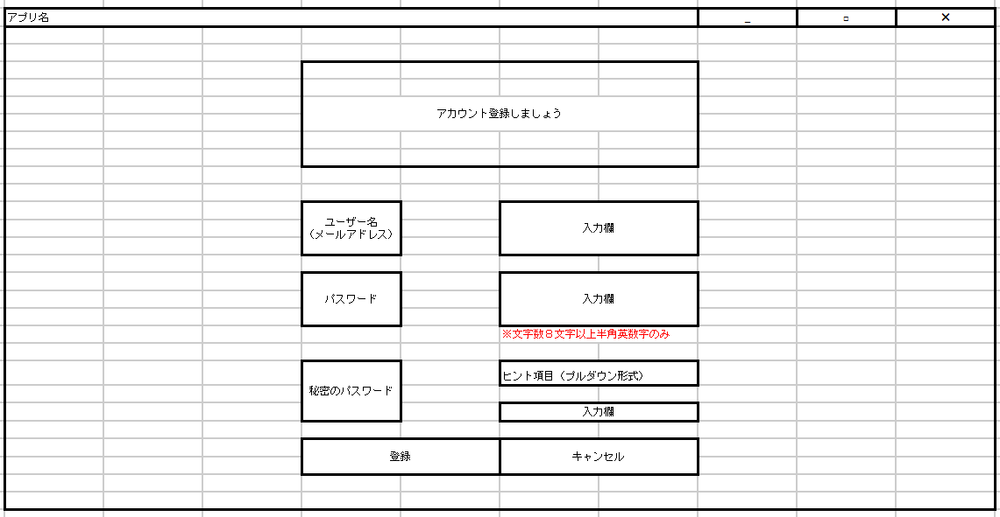

| No. | 項目名 | 固定 | 表示内容 | 備考 |
| --- | --- | --- | --- | --- |
| ① | 画面名ラベル | ○ | アカウント登録しましょう | 固定文言 |
| ② | ユーザ名ラベル | ○ | ユーザ名（メールアドレス） | 固定文言 |
| ③ | ユーザ名入力欄 |  | 入力欄 | 空文字状態の表示 |
| ④ | パスワードラベル | ○ | パスワード |  |
| ⑤ | パスワード入力欄 |  | 入力欄 | 空文字状態の表示 |
| ⑥ | 秘密のパスワードラベル | ○ | 秘密のパスワード | 固定文言 |
| ⑦ | ヒントプルダウン | ○ | ※1 | 押下可能 |
| ⑧ | 秘密のパスワード入力欄 |  | 入力欄 | 空文字状態の表示 |
| ⑨ | 登録ボタン | ○ | 登録 | 固定文言、押下不可 |
| ⑩ | キャンセルボタン | ○ | キャンセル | 固定文言、押下可能 |

※1 プルダウン押下時処理は詳細仕様②を参照

＜ユーザ名（メールアドレス）、パスワード、秘密のパスワード入力中＞

| No. | 項目名 | 固定 | 表示内容 | 備考 |
| --- | --- | --- | --- | --- |
| ① | 画面名ラベル | ○ | アカウント登録しましょう | 固定文言 |
| ② | ユーザ名ラベル | ○ | ユーザ名（メールアドレス） | 固定文言 |
| ③ | ユーザ名入力欄 |  | [画面]ユーザ名入力欄 | 入力文字を表示 |
| ④ | パスワードラベル | ○ | パスワード | 固定文言 |
| ⑤ | パスワード入力欄 |  | [画面]パスワード入力欄 | 入力文字を表示 ※5 |
| ⑥ | 秘密のパスワードラベル | ○ | 秘密のパスワード | 固定文言 |
| ⑦ | ヒントプルダウン | ○ | ※1 | 押下可能 |
| ⑧ | 秘密のパスワード入力欄 |  | [画面]秘密のパスワード入力欄 | 入力文字を表示 ※3 |
| ⑨ | 登録ボタン | ○ | 登録 | 固定文言、押下可能 ※2 ※4 |
| ⑩ | キャンセルボタン | ○ | キャンセル | 固定文言、押下可能 |

※1 プルダウン押下時処理は詳細仕様②を参照
※2 ユーザ名入力欄・秘密のパスワード入力欄がともに空文字でなく、ユーザ名がメールアドレス形式で、ヒントプルダウンが選択済みのときのみ押下可能
※3 秘密のパスワード入力欄の処理は詳細仕様⑥を参照
※4 登録処理
※5 パスワード入力欄の処理は詳細仕様⑦を参照

**詳細仕様**

① ユーザ名入力欄、パスワード入力欄、秘密のパスワード入力欄の内容をDBに登録する。

| 登録先 | 取得元 |
| --- | --- |
| `[todojava_db]users.email` | [画面]ユーザ名入力欄 |
| `[todojava_db]users.password` | [画面]パスワード入力欄 |
| `[todojava_db]users.secret_password` | [画面]秘密のパスワード入力欄 |

② ヒントダイアログの表示内容をDBより取得する。`[todojava_db]secret_tips.secret_tips_text` を取得しプルダウンとして表示（全レコード取得）。情報取得失敗時はプルダウン展開不可でブランクとする。

③ 登録ボタン押下時、登録ダイアログを表示させる。

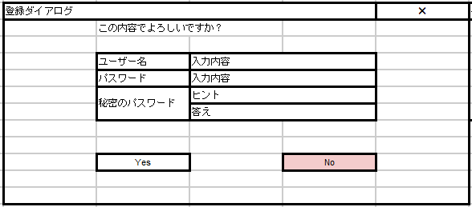

Yesボタン押下で登録処理実行。Noボタンまたはウインドウ右上の×ボタン押下で閉じ、入力画面に戻る。

④ キャンセルボタン押下時、キャンセルダイアログを表示する。

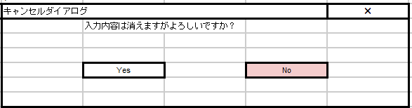

Yesボタン押下でログイン画面に戻る。Noボタンまたはウインドウ右上の×ボタン押下で閉じ、入力画面に戻る。

⑤ 登録失敗時、登録失敗ダイアログを表示する。

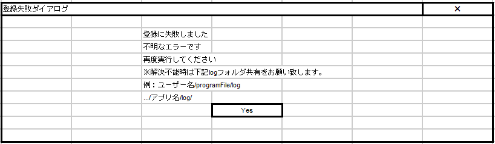

Yesボタンまたはウインドウ右上の×ボタン押下で閉じ、入力画面に戻る。

⑥ 秘密のパスワード入力欄について：ヒントプルダウンでいずれかの選択肢を選択後、入力されている秘密のパスワード入力欄の値について、ヒントプルダウンを押下し、別の選択肢を選択すると入力値をクリアする。入力内容は伏字ではなく、入力したまま表示する。

⑦ パスワード入力欄の文字について：入力内容は伏字ではなく、入力したまま表示する。

> **注記：以下は原文で唐突に登場する断片（③④）。文脈上は3.1.2〜3.1.3とは無関係な、旧Todoリストアプリの「ログイン後のタスク一覧取得失敗時」の通知ダイアログ仕様であり、RiskMapの機能ではない。誤って残存した記述と考えられるため、参考情報としてのみ残す。**

③ ログインユーザのタスク取得失敗時：ログイン認証に成功し、未完了のタスクの取得に失敗したときDB接続失敗ダイアログを出す（ログイン認証でタイムアウトしたときと同様の画面表示）。

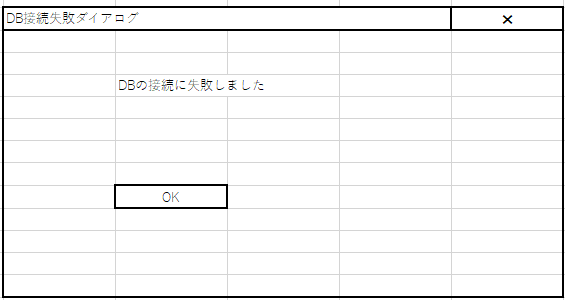

- 【該当あり】taskテーブルからログインユーザーの未完了のタスクをダイアログに表示 → 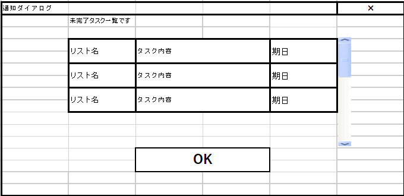
- 【該当なし】通知ダイアログは表示するが列は空文字表示 → 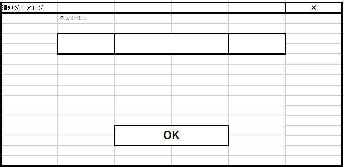

④ ガイダンス文言について：未完了のタスクが1件以上ある場合は「未完了のタスク一覧です」、0件の場合は「タスクなし」と表示する。

#### 3.1.4（原文見出し「テスト」）

> **注記：見出しが「テスト」となっているが、本文は3.1.3の概要文がそのままコピー＆ペーストされている（コピペミスと考えられる）。ログイン機能に関するテスト仕様は未記載の状態。**

概要：アカウント登録が未了のユーザに対して、メールアドレスとパスワードと忘却者へのヒントを登録するインタフェースを提供する。（原文ママ、上の3.1.3と同一文）

---

### 3.2 地図閲覧機能

#### 3.2.1 ピン表示機能

**概要**
- 登録された情報を地図上にピンとして表示する。
- ピン押下後に詳細情報を表示する。

**表示内容**

初期表示：

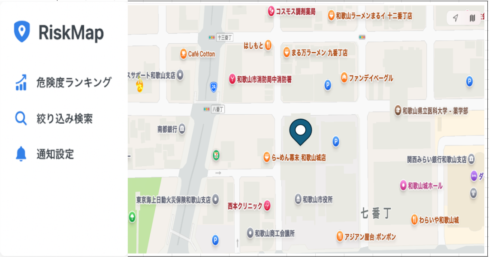

ピン押下後：

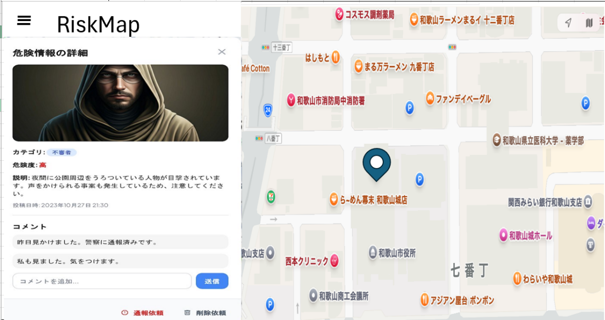

＜初期表示＞

| No. | 項目名 | 固定 | 表示内容 | 備考 |
| --- | --- | --- | --- | --- |
|  | 表示対象（ピン） | - | postテーブルのaddressを元に地図上へ表示 |  |
|  | サイトTOP | ○ |  | 押下後サイトTOP画面に遷移する |
|  | 危険度ランキング | ○ |  | 押下後危険度ランキング画面に遷移する。 |
|  | 絞り込み検索 | ○ |  | 押下後絞り込み画面に遷移する。 |
|  | 通知設定 | ○ |  | ログインユーザか否かで遷移先が変化する。 |

＜ピン押下時の表示＞

| No. | 項目名 | 固定 | 表示内容 | 備考 |
| --- | --- | --- | --- | --- |
|  | ピン | - | 初期表示と同じ | もう一度押下すると詳細表示部分が見えなくなる |
|  | 画像 | - | postテーブルのimage | 投稿情報に画像がある場合、表示。無い場合は表示しない。 |
|  | カテゴリ | ○ | postテーブルのcategory_id | category_nameのcolorに沿ってアイコンを表示する。 |
|  | 説明 | ○ | postテーブルのdetail |  |
|  | 投稿日時 | ○ | postテーブルのdenger_date |  |
|  | コメント一覧 | - | post_idに紐づいたcommentテーブルのcomment_text |  |
|  | コメント記入欄 | ○ |  | 空文字 |
|  | コメント送信ボタン | ○ |  | 押下後commentテーブル更新 |
|  | 通報依頼リンク | ○ |  | 押下後、通報依頼画面表示 |
|  | 削除依頼リンク | ○ |  | 押下後、削除依頼画面表示 |

**詳細仕様**

① コメント入力欄の内容をDBに登録する。

| 登録先 | 取得元 |
| --- | --- |
| `[RiskMap_DB]comment.comment_text` | [画面] コメント記入欄 |
| `[RiskMap_DB]comment.created_at` | [画面]コメント送信ボタン |

#### 3.2.2 ピン投稿機能

**概要**

利用者が危険情報を投稿するための機能。年月日、年月日の正確性、住所、危険カテゴリ、詳細、写真（任意）を入力し、投稿ボタン押下後に登録を行う。登録された情報は地図上へピンとして表示される。

**表示内容**

初期表示・新規投稿用画面：

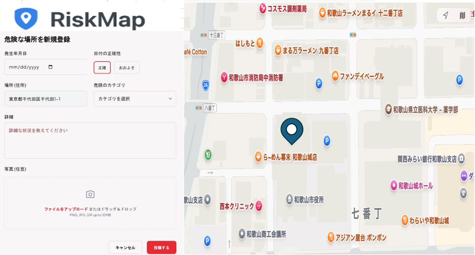

登録完了時・キャンセルボタン押下時：画面が更新され入力内容がクリアされる。
登録するボタン押下後、入力内容に不備がある場合：バリデーションエラーを表示する（下表参照）。

＜初期表示＞

| No. | 項目名 | 固定 | 表示内容 | 備考 |
| --- | --- | --- | --- | --- |
|  | 発生年月日 | ○ |  | 空文字 |
|  | 日付の正確性 | ○ |  | 空文字 |
|  | 場所 | ○ |  | 空文字 |
|  | 危険のカテゴリ | ○ |  | 空文字 |
|  | 詳細 | ○ |  | 空文字 |
|  | キャンセルボタン | ○ |  | 押下後、入力内容がクリアされる |
|  | 登録するボタン | - |  | 規制アカウントの場合、グレーアウト |

**詳細仕様**

登録ボタン押下後、入力内容をDBに登録する。

| 登録先 | 取得元 |
| --- | --- |
| `[RiskMap_DB]post.denger_date` | [画面] 発生年月日欄 |
| `[RiskMap_DB]post.accurate_flg` | [画面]日付の正確性 |
| `[RiskMap_DB]post.address` | [画面] 場所欄 |
| `[RiskMap_DB]post.category_id` | [画面]危険のカテゴリ欄 |
| `[RiskMap_DB]post.detail` | [画面]詳細欄 |

登録するボタン押下後入力チェック：

| 項目名 | 表示内容 | 表示文 |
| --- | --- | --- |
| 発生年月日 | 未入力の場合、詳細欄の下にエラーメッセージを表示する。 | 発生年月日を入力してください。 |
| 場所 | 未入力の場合、詳細欄の下にエラーメッセージを表示する。 | 場所を入力してください。 |
| 危険のカテゴリ | 未選択の場合、詳細欄の下にエラーメッセージを表示する。 | 危険カテゴリを選択してください。 |
| 詳細 | 未入力の場合、詳細欄の下にエラーメッセージを表示する。 | 詳細文を入力してください。 |

---

## 未記載の章（原文はここで終了）

`ソフトウェア仕様書_WBS.xlsx`（`ソフトウェア仕様書_WBS.md`）のステータスに基づくと、以下は本書ではまだ「未着手」または未記載：

- 3.2.3 コメント機能（詳細仕様）
- 3.3 通知機能（エリア通知機能・アラート機能）
- 3.4 削除・通報依頼機能
- 3.5 危険度ランキング機能
- 3.6 絞り込み検索機能

これらの機能要件は `要件資料.md` におおまかな仕様があるので、詳細設計時はそちらを一次情報として参照すること。
