# 画面遷移図

> 元ファイル: `DOC/基本設計書/画面遷移図.xlsx`（`画面遷移図.pdf` は同内容の書き出し版と思われる）
>
> 元ファイルはExcelシート上に画面キャプチャ画像と矢印コネクタ・注記テキストボックスを配置して作成された画面遷移図であり、セルにテキストデータは入っていない。マークダウン化にあたり、埋め込まれていた画面キャプチャ画像を `assets/画面遷移図/` 配下に抽出し、遷移のきっかけとなる操作（テキストボックスの文言）を各シートごとに書き出した。矢印の始点・終点（どの画面からどの画面へ繋がるか）は大半のコネクタが図形として厳密に接続されておらず、自動抽出では再現できなかったため、正確な接続関係は元の `.xlsx` / `.pdf` を参照すること。

## シート: ログイン無し

画面遷移のきっかけとなる操作（抽出したテキストボックスの文言、出現順）:

- RiskMapロゴ押下
- ピン押下
- 絞り込み検索リンク押下
- 危険度ランキングリンク押下
- 検索ボタン押下
- 新規アカウント登録リンク押下

対応すると思われる画面（画像）:

| 画面 | 画像 |
| --- | --- |
| 地図閲覧（初期表示） | 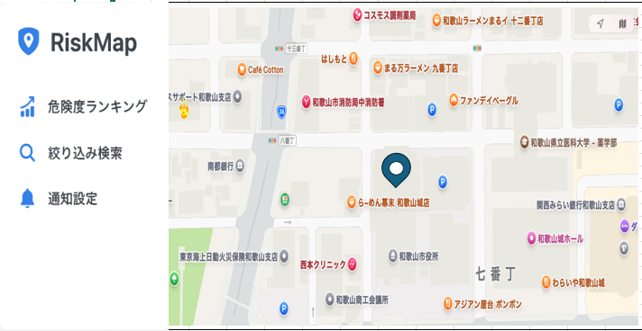 |
| 危険度ランキング | 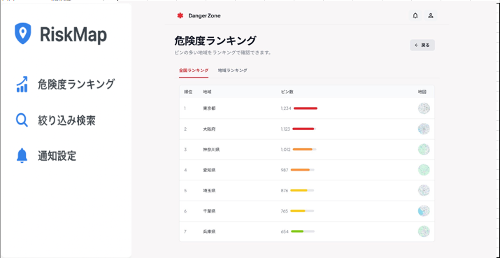 |
| 絞り込み検索 | 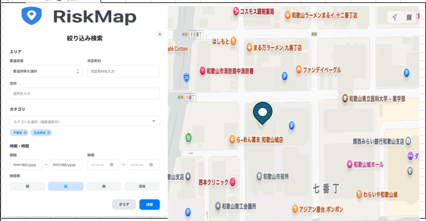 |
| ピン押下時（危険情報の詳細） | 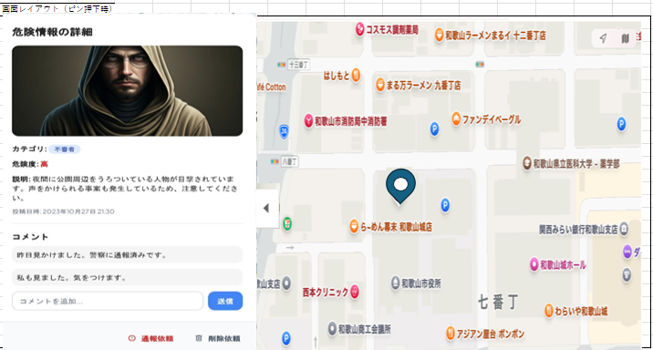 |
| 新規アカウント登録 | 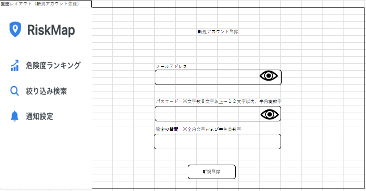 |

## シート: ログイン有り

画面遷移のきっかけとなる操作（抽出したテキストボックスの文言、出現順）:

- ログイン成功
- ログイン失敗
- 絞り込み検索リンク押下
- 危険度ランキングリンク押下
- 通知設定リンク押下
- ピン押下
- 新規登録押下
- コメント投稿押下
- パスワードをお忘れの方リンク押下
- 秘密の質問が間違っていた場合
- メール内に記載されたURLを押下

対応すると思われる画面（画像）:

| 画面 | 画像 |
| --- | --- |
| ログイン（エラー表示、別デザイン案） | 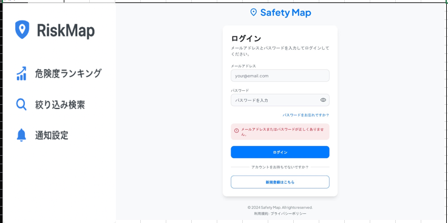 |
| ログイン失敗時（ワイヤーフレーム版） | 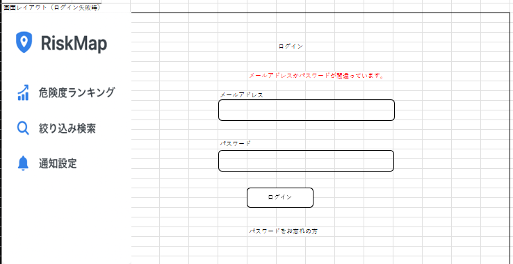 |
| Myエリア設定 | 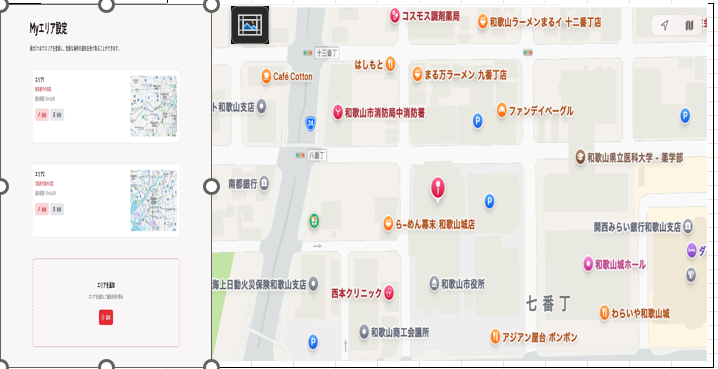 |
| 新規投稿用画面 | 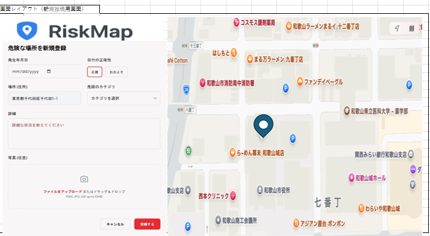 |
| コメント追加用ポップアップ | 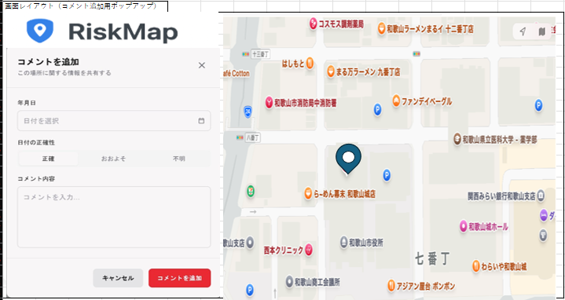 |
| パスワード再設定（秘密の質問） | 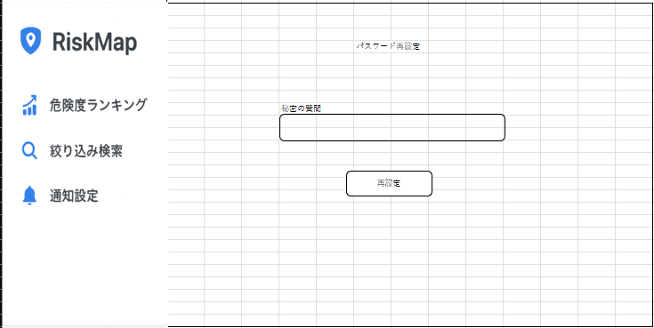 |
| 秘密の質問を忘れた時（メール送信） | 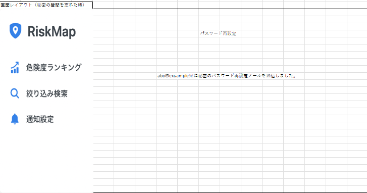 |

## 画面遷移フロー（概要・テキストボックスの文言と画面内容からの推定）

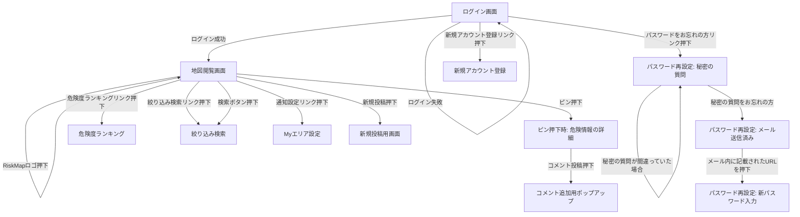

※ この図は自動抽出した操作ラベルと画面キャプチャの内容から人手で推定した概略フローであり、元の`.xlsx`/`.pdf`にある正確な矢印の接続を保証するものではない。正式な遷移仕様として扱う場合は原本を確認すること。
